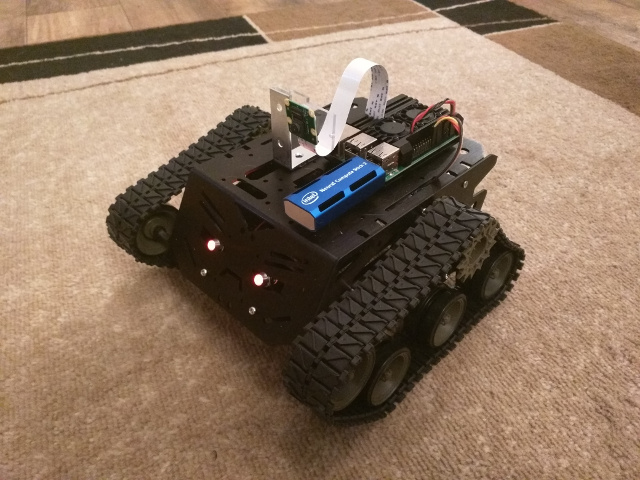

# RPi3_NCS2
Intel Neural Compute Stick 2 Running on RPI 3 with ~~Threading~~ Multiprocessing

These Scripts allow you to do Object detection on the Raspberry Pi 3B+ using the Intel Neural Compute stick.
Examples are provided that make use of USB cameras or the PiCam.

This pretty decent framerate was achived by moving the blocking operation (net.forward()) is removed to a ~~thread~~ process, along with a bunch of related stuff(pre-processing the frame etc).

Follow the instructions here to set up and configure your Pi:
https://software.intel.com/en-us/articles/OpenVINO-Install-RaspberryPI

The following scripts are provided in src/:

**UPDATE 20 Feb 2019** 
A new script is available! up to **30FPS** video, up to **28FPS** detection speed using MobileNet SSD, on a single NCS2! This is more like it!

**refined_picam_test_NCS2_mobilenet.py**

A number of changes have been made to the original script.
First and foremost I must mention threading. This was actually ditched early on in favour of processes in all my scripts.

Video grabbed from the picam is initially 304x304, this reduces overhead, and anything bigger is wasteful, since our network input layer is ony 300x300 in any case.

Almost all processing that formerly took place in the main video thread has now been moved out to subprocesses. The only thing that happens (and should happen) in the main loop, is read a frame from the camera, push and pull data, display bounding boxes and display frames.

There are probably a few more things to tweak here (get rid of some more math out of the loop, etc) to milk every last cycle out of the CPU and NCS2 and tidy things up a bit, but I would say this is about done, and is certainly very usable in its current form!

Enjoy!

**UPDATE! Robot Code added 18/01/2019!**

**2_robot_picam_test_NCS2_mobilenet.py**
This script allows you to control a robot platform to track and chase any object in the MobileNet-SSD model!
See: https://www.youtube.com/watch?v=Y5V331kbSvY&list=PLB2Z43zIP_3a8-eNjE5i-EajiCa-bXxgM for a demo!
Currently it follows beer bottles, but alter one int in the code (object id) and the expected width of your object, and with a little tweaking you can have it follow a person, the cat, the dog, or whatvever else you like...

**openvino_fd_myriad.py**
Original single image detection script from: https://software.intel.com/en-us/articles/OpenVINO-Install-RaspberryPI
You should build it and run it to verify your OpenCV installation

**pi_NCS_USB_cam_test1.py**
**pi_NCS_USB_cam_test2.py**
Naive initial scripts (experiments), all the work prepping and forwarding is done in the main thread.

**pi_NCS2_USB_cam_threaded_mobilenet.py**
Threaded example using the mobilenet-ssd model, converted from the caffe model using the OpenVino toolkit
The models are present in src/models to save you a job:

**pi_NCS2_USB_cam_threaded_faces.py**
~~Threaded~~ Multi Processing example using the models from: https://download.01.org/openvinotoolkit/2018_R4/open_model_zoo/
Specifically face-detection-retail-0004

**Note:**
Camera settings are altered using:
cap.set(cv2.CAP_PROP_FRAME_WIDTH, frameWidth)
cap.set(cv2.CAP_PROP_FRAME_HEIGHT, frameHeight)
cap.set(cv2.CAP_PROP_FPS, framesPerSec)

Check what your camera is capable of if you get errors, some cameras do FPS in mutiples of 10, some use multiples of 6!
Setting a camera to say 24 fps when it expects either 20 or 30 will cause the script to bomb out.

***ALSO:***
If you suddenly get a terrible framerate, try turning the lights up! My USB cam at least, throttles its own framerate if lighting is poor, presumably it perfroms frame integration in low light(cv2.CAP_PROP_FPS does not seem to report this!).

***UPDATE YOLOv3***
2 scripts have been added with kind permission based on the awesome work of Pinto: https://github.com/PINTO0309/OpenVINO-YoloV3/
Pinto has been playing with NCS and OpenVINO for some time, you should definitely head on over there!

***yolo_images_test.py***
This script reads an image called in.jpg and shows and writes an image called out.png with bounding boxes and labels:

***yolo_test_threaded***
This script is heavily based on that by Pinto, however I have threaded a couple or parts to allow it to run reasonably on the RPi3B+ and NCS2

Both scripts require the YOLOV3 model, which is available here:
https://drive.google.com/open?id=1fw3O5_13PkjQj2xM2lt8vRzP2VQ_z1a7

